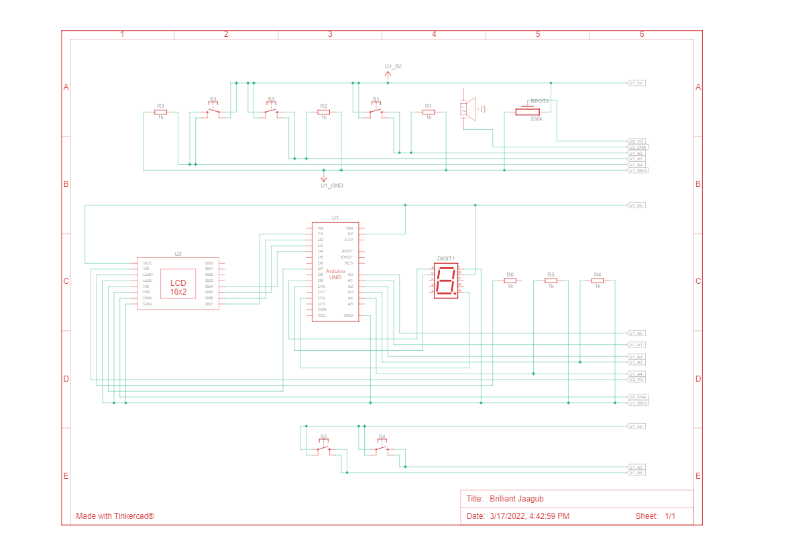

# Dance Dance Arduino

## Description
An Arduino implementation of famous rhythm game Dance Dance Revolution

All the thrills of DDR can be enjoyed through the compact set of the ELEGOO UNO Project Starter Kit, an 8x8 Matrix LED, and an Arduino Speaker. Players press corresponding arrow keys to the beat of the music.

## Instructions
* Press any button to start the game
* Press the corresponding button when the arrow reaches the top of the LED
* You have 3 lives, miss three notes and its game over!
* Your score is recorded and displayed on the Arduino LCD

## Hardware
* MAX 7210 8x8 Dot Matrix Display Module
* LCD1602 Module
* Makerhawk Arduino Speaker
* UNO R3 Controller Board
* Arduino Starter Pack Buttons, Resistors, Jumpers Wires

## Wiring Diagram

## Gameplay Demo

